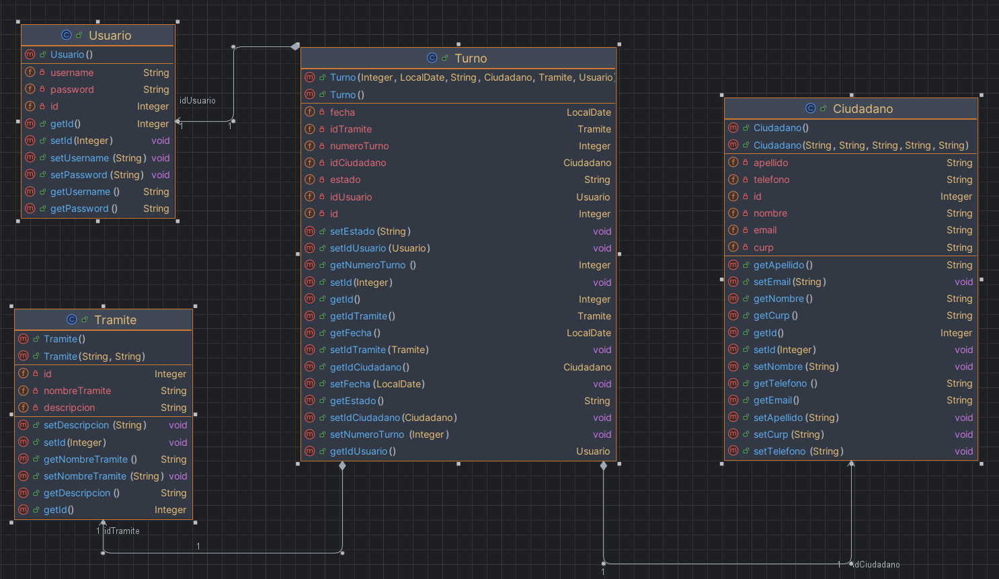
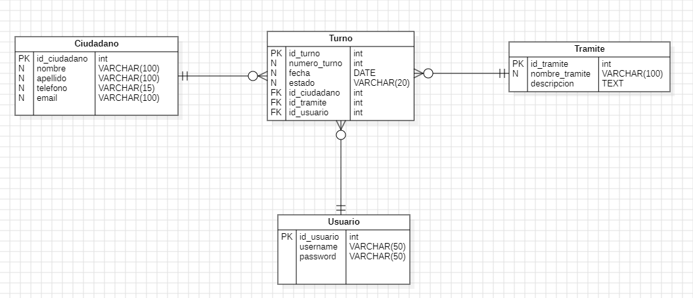

# Prueba Tecnica 2 - HACKABOSS

Este es el código de la segunda prueba técnica.
La cual es un sistema de gestion de turnos y citas.
Puede visualizar el funcionamiento de la aplicación a continuación ⬇️

## Demo


## Instalación

Clonar repositorio de GitHub

```bash
  git clone https://github.com/EzzCream/OscarRodriguezCarmona_pruebatec2.git
```

Se tiene que correr el .sql para generar la base de datos en Mysql

## Requerimientos

#### Requerimientos funcionales

| RF  | Acción                   | Descripción                                                                                     |
| :-- | :----------------------- | :---------------------------------------------------------------------------------------------- |
| RF1 | Agregar turno            | Se debe permitir crear un nuevo turno ingresando la información necesaria en la base de datos.  |
| RF2 | Listar turno             | Se debe poder listar todos los turnos registrados en el sistema.                                |
| RF3 | Agregar ciudadano        | Se debe permitir ingresar la información de un nuevo ciudadano y guardarlo en la base de datos. |
| RF4 | Eliminar ciudadano       | Se debe permitir eliminar la información de un ciudadano identificado por su ID.                |
| RF5 | Actualizar ciudadano     | Se debe permitir modificar la información de un ciudadano identificado por su ID.               |
| RF6 | Listar ciudadano         | Se debe poder listar todos los ciudadanos registrados en el sistema.                            |
| RF7 | Agregar trámite          | Se debe permitir crear un nuevo trámite y guardarlo en la base de datos.                        |
| RF8 | Visualizar trámite       | Se debe poder consultar la información detallada de un trámite registrado.                      |
| RF9 | Estado espera y atendido | Se debe permitir visualizar y actualizar el estado de un trámite como "En espera" o "Atendido". |

#### Requerimientos no funcionales

| RNF  | Tecnología o Característica | Descripción                                                                                   |
| :--- | :-------------------------- | :-------------------------------------------------------------------------------------------- |
| RNF1 | Login                       | El sistema debe contar con un mecanismo seguro de autenticación de usuarios.                  |
| RNF2 | Java                        | El sistema debe estar desarrollado utilizando Java como lenguaje principal.                   |
| RNF3 | HTML y CSS                  | La interfaz de usuario debe estar diseñada utilizando HTML y CSS para una experiencia óptima. |
| RNF4 | MySQL                       | La base de datos utilizada debe ser MySQL para almacenar y gestionar la información.          |
| RNF5 | JSP                         | Se deben utilizar páginas JSP para el manejo de vistas dinámicas en el sistema.               |
| RNF6 | JPA                         | El sistema debe emplear JPA para la gestión de persistencia y mapeo de datos.                 |
| RNF7 | Colecciones y objetos       | El sistema debe gestionar la información mediante colecciones y objetos de manera eficiente.  |
| RNF8 | Funciones lambda            | El sistema debe aprovechar el uso de funciones lambda para optimizar el manejo de datos.      |

## Supuestos

-   Se asume que todos los campos son obligatorios al momento de agregar o actualizar un registro.
-   La fecha de inicio debe estar en un formato válido (ISO 8601: YYYY-MM-DD).
-   El proceso de actualización requiere un identificador único del empleado (por ejemplo, el campo id generado por la base de datos) para garantizar que se edite el registro correcto.
-   Se asume que la eliminación de un empleado es una operación irreversible. No se implementa una funcionalidad de "papelera" o "archivado".
-   La búsqueda es sensible a mayúsculas o minúsculas.
-   La resolucion en la que se va a visualizar es en 1080p.

## Clases

-   La clase `Ciudadano` es una entidad JPA que representa a un ciudadano en el sistema de turnos. Está mapeada a la tabla `ciudadano` en el esquema `turnero` de la base de datos. Contiene atributos como `id`, `nombre`, `apellido`, `telefono`, `email` y `curp`, junto con métodos getter y setter para gestionar esta información.

-   La clase `Tramite` es una entidad JPA que representa un trámite en el sistema de turnos. Está mapeada a la tabla `tramite` en el esquema `turnero` de la base de datos. Contiene los atributos `id`, `nombreTramite` y `descripcion`, junto con métodos getter y setter para gestionar esta información.

-   La clase `Turno` es una entidad JPA que representa un turno en el sistema de turnos. Está mapeada a la tabla `turno` en el esquema `turnero` de la base de datos. Contiene los atributos `id`, `numeroTurno`, `fecha`, `estado`, `idCiudadano`, `idTramite`, y `idUsuario`.

-   La clase `Usuario` es una entidad JPA que representa un usuario en el sistema de turnos. Está mapeada a la tabla `usuario` en el esquema `turnero` de la base de datos. Contiene los atributos `id`, `username` y `password`.

-   La clase `ControladoraLogica` actúa como la capa lógica entre la interfaz de usuario y la capa de persistencia en el sistema de turnos. Utiliza la clase `ControladoraPersistencia` para interactuar con la base de datos y gestionar los ciudadanos, trámites, turnos y usuarios.

-   La clase `CiudadanoJpaController` es responsable de gestionar las operaciones de persistencia relacionadas con la entidad `Ciudadano` en la base de datos utilizando JPA (Java Persistence API). Permite realizar operaciones como crear, editar, eliminar y consultar ciudadanos.

-   La clase `ControladoraPersistencia` actúa como intermediaria entre la capa lógica y la capa de persistencia, gestionando las operaciones de acceso a datos para las entidades `Ciudadano`, `Usuario`, `Turno`, y `Tramite`. Esta clase coordina las operaciones de creación, lectura, actualización y eliminación (CRUD) mediante el uso de sus respectivos controladores JPA.

-   La clase `TramiteJpaController` gestiona las operaciones de persistencia para la entidad `Tramite`, utilizando JPA (Java Persistence API). Esta clase proporciona métodos para crear, editar, eliminar, y consultar objetos `Tramite` en la base de datos.
-   La clase `TurnoJpaController` gestiona las operaciones de persistencia de la entidad `Turno` mediante JPA (Java Persistence API).
-   `UsuarioJpaController` gestiona las operaciones de persistencia de la entidad `Usuario` utilizando JPA (Java Persistence API).
-   `ActualizarCiudadanoSv` es un servlet que maneja la actualización de los datos de un ciudadano en la base de datos. Utiliza la lógica de negocio proporcionada por la clase `ControladoraLogica` para interactuar con los datos y actualizar la información en el sistema.
-   La clase `CiudadanoSv` es un servlet que maneja la creación y la consulta de ciudadanos en el sistema. Utiliza la clase `ControladoraLogica` para interactuar con la base de datos y realizar las operaciones correspondientes.

## Diagrama de clases



## Diagrama entidad relacion



## Metodos

-   **`crearCiudadano`**: Crea un nuevo ciudadano en la base de datos.
-   **`listarCiudadanos`**: Obtiene una lista de ciudadanos que coinciden con un CURP específico.
-   **`eliminarCiudadano`**: Elimina un ciudadano de la base de datos usando su ID.
-   **`listarCiudadano`**: Obtiene un ciudadano por su ID.
-   **`actualizarCiudadano`**: Actualiza la información de un ciudadano existente.
-   **`validar`**: Función lambda que valida el nombre de usuario y la contraseña para la autenticación.
-   **`listaTurnos`**: Obtiene una lista de todos los turnos registrados en el sistema.
-   **`listaTurnosEstado`**: Obtiene los turnos que tienen un estado específico (como "en espera" o "atendido").
-   **`createTramite`**: Crea un nuevo trámite en el sistema.
-   **`lsitarTramiteNombre`**: Obtiene un trámite por su nombre.
-   **`createTurno`**: Crea un nuevo turno con los detalles proporcionados (número, fecha, estado, ciudadano, trámite y usuario).
-   **`listarUsuario`**: Obtiene un usuario por su nombre de usuario.
-   **`listarCiudadano`**: Obtiene un ciudadano por su CURP.
-   **`getCiudadanosByCurp`**: Consulta a la base de datos los ciudadanos que coinciden con un CURP específico.
-   **`getCiudadanoByCurp`**: Obtiene un ciudadano por su CURP. Si no se encuentra, retorna `null`.
-   **`crearCiudadano`**: Crea un nuevo ciudadano utilizando el controlador JPA correspondiente.
-   **`traerCiudadanosCurp`**: Recupera una lista de ciudadanos que coinciden con un CURP específico.
-   **`eliminarCiudadano`**: Elimina un ciudadano de la base de datos mediante su ID, utilizando el controlador JPA.
-   **`listarCiudadano`**: Recupera un ciudadano por su ID.
-   **`actualizarCiudadano`**: Actualiza los datos de un ciudadano existente.
-   **`buscarUsuario`**: Busca un usuario en la base de datos mediante su nombre de usuario.
-   **`listaTurnos`**: Recupera todos los turnos existentes.
-   **`traerTurnoEstado`**: Recupera los turnos filtrados por su estado (ej., "en espera", "atendido").
-   **`crearTramite`**: Crea un nuevo trámite en la base de datos.
-   **`listarTramiteNombre`**: Recupera un trámite por su nombre.
-   **`crearTurno`**: Crea un nuevo turno en la base de datos.
-   **`traerCiudadanoCurp`**: Recupera un ciudadano por su CURP.
-   **`getTramiteByName(String nombreTramite)`**: Recupera un trámite por su nombre. Si no se encuentra, retorna `null`.
-   **`findTurnoByEstado(String estado)`** Recupera todos los registros de la tabla `Turno` cuyo estado sea el proporcionado (por ejemplo, "Ya atendido" o "En espera"). **Ordenación**: Los registros se ordenan por la fecha en orden ascendente.
    `getUsuario(String username)`Busca un `Usuario` en la base de datos usando su nombre de usuario. El objeto `Usuario` correspondiente al `username` dado, o `null` si no se encuentra ningún resultado.

### `doGet(HttpServletRequest request, HttpServletResponse response)`

-   **Descripción**: Método HTTP GET que se encarga de recibir una solicitud para actualizar un ciudadano.
-   **Funcionamiento**:

    1. Obtiene el `id` del ciudadano a actualizar desde el parámetro de la solicitud.
    2. Llama a `controladoraLogica.listarCiudadano(id)` para obtener el objeto `Ciudadano` correspondiente.
    3. Guarda el objeto `Ciudadano` en la sesión del usuario bajo el atributo `"ciudadanoActualizar"`.
    4. Redirige al usuario a la página de actualización (`./pages/actualizarCiudadano.jsp`).

    **Descripción**: Método HTTP GET que se encarga de consultar los ciudadanos por su CURP.

-   **Funcionamiento**:

    1. Obtiene el parámetro `curp` desde la solicitud.
    2. Llama a `controladoraLogica.listarCiudadanos(curp)` para obtener la lista de ciudadanos que coinciden con el `curp`.
    3. Guarda la lista de ciudadanos en la sesión bajo el atributo `"listaCiudadanos"`.
    4. Redirige al usuario a la página `ciudadanoMenu.jsp` donde se mostrarán los ciudadanos encontrados.

    **Descripción**: Método HTTP GET que maneja la solicitud de inicio de sesión.

-   **Funcionamiento**:
    1. Obtiene los parámetros `username` (nombre de usuario) y `password` (contraseña) de la solicitud HTTP.
    2. Llama a `controladoraLogica.validar(username, password)` para verificar si las credenciales son correctas.
    3. Si la validación es exitosa (`autorizar == true`), crea una sesión (`HttpSession`) y guarda el `username` en la sesión como atributo.
    4. Redirige al usuario a la página `ciudadanoMenu.jsp`, donde puede interactuar con la aplicación.
    5. Si la validación falla, redirige al usuario de vuelta a la página de inicio de sesión (`index.jsp`).

### `doPost(HttpServletRequest request, HttpServletResponse response)`

-   **Descripción**: Método HTTP POST que se encarga de procesar los datos del formulario de actualización de ciudadano.
-   **Funcionamiento**:

    1. Obtiene los nuevos valores (`nombre`, `apellido`, `email`, `telefono`, `curp`) del formulario de actualización.
    2. Recupera el objeto `Ciudadano` almacenado en la sesión para actualizar sus atributos con los nuevos valores.
    3. Llama a `controladoraLogica.actualizarCiudadano(ciudadano)` para persistir los cambios en la base de datos.
    4. Actualiza la lista de ciudadanos basándose en el `curp` y la guarda en la sesión bajo el atributo `"listaCiudadanos"`.
    5. Redirige al usuario a la página de menú de ciudadanos (`pages/ciudadanoMenu.jsp`).

-   **Descripción**: Método HTTP POST que maneja la creación de un nuevo ciudadano.
-   **Funcionamiento**:

    1. Obtiene los parámetros `nombre`, `apellido`, `email`, `telefono`, y `curp` desde la solicitud.
    2. Llama a `controladoraLogica.crearCiudadano()` para crear un nuevo ciudadano con los datos proporcionados.
    3. Después de la creación, llama a `controladoraLogica.listarCiudadanos(curp)` para obtener la lista actualizada de ciudadanos que coinciden con el `curp`.
    4. Guarda la lista de ciudadanos en la sesión bajo el atributo `"listaCiudadanos"`.
    5. Redirige al usuario a la página `ciudadanoMenu.jsp` con la lista de ciudadanos actualizada.

-   **Descripción**: Método HTTP POST que maneja la eliminación de un ciudadano.
-   **Funcionamiento**:

    1. Obtiene el parámetro `id` desde la solicitud (el ID del ciudadano a eliminar).
    2. Obtiene el parámetro `CURP` para obtener el CURP del ciudadano.
    3. Llama a `controladoraLogica.eliminarCiudadano(id)` para eliminar el ciudadano con el ID proporcionado.
    4. Llama a `controladoraLogica.listarCiudadanos(curp)` para obtener la lista actualizada de ciudadanos con el mismo CURP.
    5. Guarda la lista de ciudadanos actualizada en la sesión bajo el atributo `"listaCiudadanos"`.
    6. Redirige al usuario a la página `ciudadanoMenu.jsp` donde se mostrará la lista de ciudadanos actualizada.

-   **Descripción**: Este método maneja las solicitudes HTTP POST. Se utiliza para crear un nuevo trámite y asignar un turno a un ciudadano.
-   **Funcionamiento**:
    1. **Recibe los parámetros del formulario**:
        - `nombreTramite`: El nombre del trámite.
        - `descripcion`: La descripción del trámite.
        - `curp`: El CURP del ciudadano que solicita el trámite.
        - `fecha`: La fecha en la que el trámite será realizado.
        - `numeroTurno`: El número de turno asignado.
    2. **Crea el trámite**: Llama al método `controladoraLogica.createTramite(nombreTramite, descripcion)` para crear el nuevo trámite en la base de datos.
    3. **Busca el trámite y el ciudadano**:
        - Recupera el trámite utilizando el nombre proporcionado con `controladoraLogica.lsitarTramiteNombre(nombreTramite)`.
        - Busca el ciudadano utilizando el CURP con `controladoraLogica.listarCiudadano(curp)`.
    4. **Recupera el usuario**: Busca el usuario "admin1" para asociarlo con el turno, usando `controladoraLogica.listarUsuario("admin1")`.
    5. **Convierte la fecha**: Convierte la fecha recibida en el formato adecuado utilizando `utils.FechaUtil.fechaFormato(fecha)`.
    6. **Crea el turno**: Llama a `controladoraLogica.createTurno(numeroTurno, newFecha, estado, ciudadano, tramite, usuario)` para crear un nuevo turno asociado al trámite.
    7. **Redirige al menú del ciudadano**: Después de completar la creación del trámite y el turno, redirige al usuario a la página `ciudadanoMenu.jsp`.
