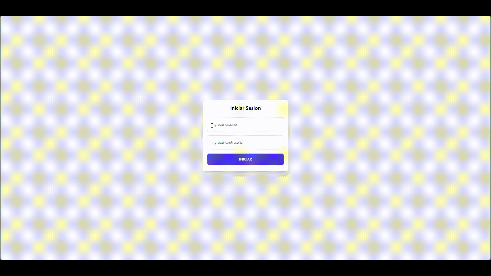

# Prueba Tecnica 2 - HACKABOSS

Este es el código de la segunda prueba técnica.
La cual es un sistema de gestion de turnos y citas.
Puede visualizar el funcionamiento de la aplicación a continuación ⬇️

## Demo



## Instalación

Clonar repositorio de GitHub

```bash
  git clone https://github.com/EzzCream/OscarRodriguezCarmona_pruebatec2.git
```

Se tiene que correr el .sql para generar la base de datos en Mysql

## Requerimientos

#### Requerimientos funcionales

| RF  | Acción                   | Descripción                                                                                     |
| :-- | :----------------------- | :---------------------------------------------------------------------------------------------- |
| RF1 | Agregar turno            | Se debe permitir crear un nuevo turno ingresando la información necesaria en la base de datos.  |
| RF2 | Listar turno             | Se debe poder listar todos los turnos registrados en el sistema.                                |
| RF3 | Agregar ciudadano        | Se debe permitir ingresar la información de un nuevo ciudadano y guardarlo en la base de datos. |
| RF4 | Eliminar ciudadano       | Se debe permitir eliminar la información de un ciudadano identificado por su ID.                |
| RF5 | Actualizar ciudadano     | Se debe permitir modificar la información de un ciudadano identificado por su ID.               |
| RF6 | Listar ciudadano         | Se debe poder listar todos los ciudadanos registrados en el sistema.                            |
| RF7 | Agregar trámite          | Se debe permitir crear un nuevo trámite y guardarlo en la base de datos.                        |
| RF8 | Visualizar trámite       | Se debe poder consultar la información detallada de un trámite registrado.                      |
| RF9 | Estado espera y atendido | Se debe permitir visualizar y actualizar el estado de un trámite como "En espera" o "Atendido". |

#### Requerimientos no funcionales

| RNF  | Tecnología o Característica | Descripción                                                                                   |
| :--- | :-------------------------- | :-------------------------------------------------------------------------------------------- |
| RNF1 | Login                       | El sistema debe contar con un mecanismo seguro de autenticación de usuarios.                  |
| RNF2 | Java                        | El sistema debe estar desarrollado utilizando Java como lenguaje principal.                   |
| RNF3 | HTML y CSS                  | La interfaz de usuario debe estar diseñada utilizando HTML y CSS para una experiencia óptima. |
| RNF4 | MySQL                       | La base de datos utilizada debe ser MySQL para almacenar y gestionar la información.          |
| RNF5 | JSP                         | Se deben utilizar páginas JSP para el manejo de vistas dinámicas en el sistema.               |
| RNF6 | JPA                         | El sistema debe emplear JPA para la gestión de persistencia y mapeo de datos.                 |
| RNF7 | Colecciones y objetos       | El sistema debe gestionar la información mediante colecciones y objetos de manera eficiente.  |
| RNF8 | Funciones lambda            | El sistema debe aprovechar el uso de funciones lambda para optimizar el manejo de datos.      |

## Supuestos

-   Se asume que todos los campos son obligatorios al momento de agregar o actualizar un registro.
-   La fecha de inicio debe estar en un formato válido (ISO 8601: YYYY-MM-DD).
-   El proceso de actualización requiere un identificador único del empleado (por ejemplo, el campo id generado por la base de datos) para garantizar que se edite el registro correcto.
-   Se asume que la eliminación de un empleado es una operación irreversible. No se implementa una funcionalidad de "papelera" o "archivado".
-   La búsqueda es sensible a mayúsculas o minúsculas.
-   La resolucion en la que se va a visualizar es en 1080p.

## Clases

-   La clase `Ciudadano` es una entidad JPA que representa a un ciudadano en el sistema de turnos. Está mapeada a la tabla `ciudadano` en el esquema `turnero` de la base de datos. Contiene atributos como `id`, `nombre`, `apellido`, `telefono`, `email` y `curp`, junto con métodos getter y setter para gestionar esta información.

-   Empleado:
    La clase Empleado representa una entidad en el modelo lógico de la aplicación y está diseñada para mapearse a una tabla de la base de datos llamada empleado dentro de la tabla empleados. Esta clase encapsula toda la información relacionada con un empleado y proporciona métodos para acceder y modificar sus propiedades.
-   ControladorPersistencia:
    La clase ControladorPersistencia actúa como un intermediario entre la capa lógica de la aplicación y la capa de persistencia basada en JPA. Su propósito es gestionar las operaciones CRUD y consultas relacionadas con la entidad Empleado. Esta clase utiliza un controlador específico, EmpleadoJpaController, para interactuar directamente con la base de datos.
-   EmpleadoJpaController:
    La clase EmpleadoJpaController es un controlador de persistencia que encapsula las operaciones de manejo de la entidad Empleado en una base de datos. (Autogenerado con NetBeans)
-   FechaUtil:
    La clase FechaUtil es una utilidad que proporciona un método estático para obtener una fecha en el formato adecuado (yyyy-MM-dd).
-   Menu:
    La clase Menu proporciona una interfaz de usuario basada en texto para interactuar con la aplicación de gestión de empleados. Incluye métodos para mostrar opciones al usuario, capturar entradas, y realizar operaciones relacionadas con los empleados como creación, listado, modificación, eliminación y búsqueda.

## Metodos

#### Crear Empleado

**Método:** `crearEmpleado(Empleado emp)`  
**Descripción:**  
Recibe un objeto de tipo `Empleado` y lo persiste en la base de datos utilizando el método `create` de `EmpleadoJpaController`.

#### Obtener Empleados por Cargo

**Método:** `obtenerEmpleado(String cargo)`  
**Descripción:**  
Devuelve una lista de empleados que tienen un cargo específico. Llama al método `findByCargo` de `EmpleadoJpaController`.

#### Eliminar Empleado

**Método:** `eliminarEmpleado(int id)`  
**Descripción:**  
Elimina un empleado de la base de datos en función de su ID.

**Manejo de Excepciones:**  
Captura la excepción `NonexistentEntityException` si el empleado con el ID especificado no existe y registra el error en el log.

#### Traer Empleado por ID

**Método:** `traerEmpleado(int id)`  
**Descripción:**  
Recupera un empleado específico de la base de datos utilizando su ID. Llama al método `findEmpleado` de `EmpleadoJpaController`.

#### Listar Todos los Empleados

**Método:** `traerEmpleados()`  
**Descripción:**  
Devuelve una lista de todos los empleados en la base de datos. Llama al método `findEmpleadoEntities` de `EmpleadoJpaController`.

#### Modificar Empleado

**Método:** `modificarEmpleado(Empleado emp)`  
**Descripción:**  
Actualiza los datos de un empleado existente en la base de datos.

#### Formatear fecha

**Método:** `fechaFormato()`  
**Descripción:**

-   Lee una fecha ingresada por el usuario a través de la consola.
-   Valida que la fecha cumpla con el formato especificado `yyyy-MM-dd`.
-   Convierte la fecha a un objeto `LocalDate` para su posterior uso.
